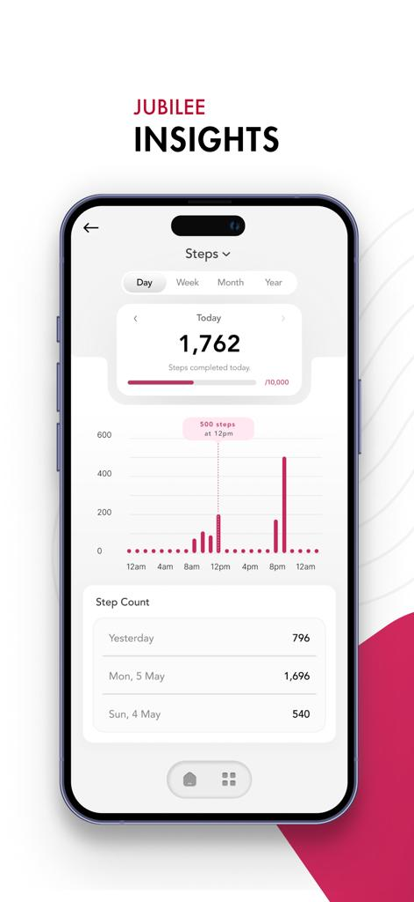
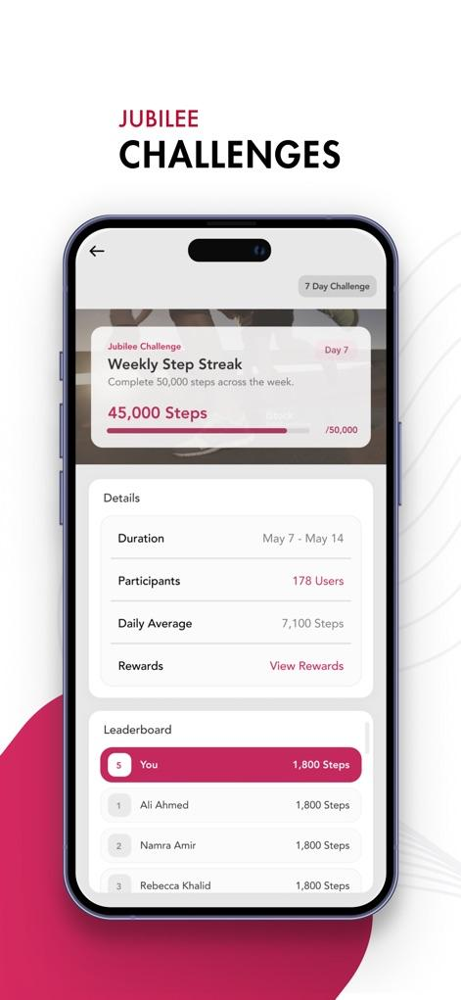
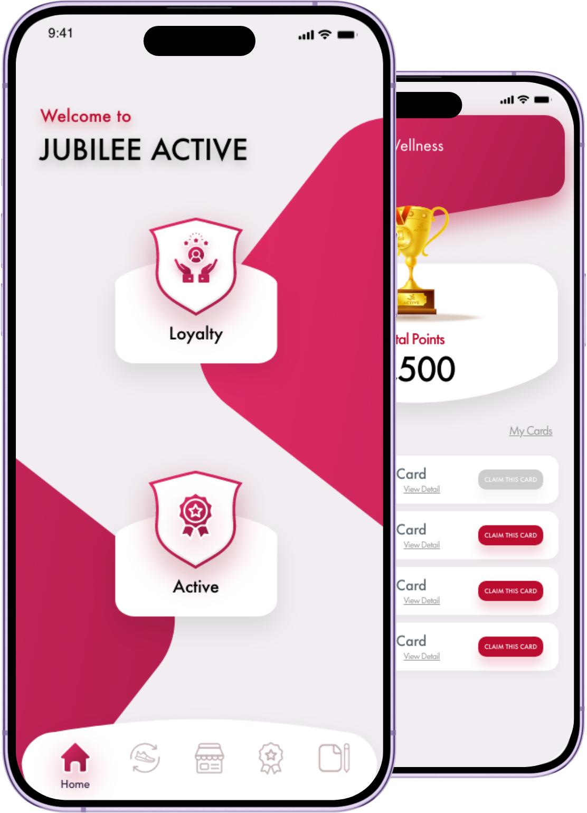

# SureCover
Swift + UIKit insurance portfolio demo using **lightweight VIPER**. Storyboard navigation, Presenter/Interactor/View separation, Dependency Injection, async mock data and UIKit table UI.

## Screenshots

  
  
  

## Key Features

- Insurance policy management workflow
- Dashboard and policy-related screens
- Rewards, wellness, and activity tracking
- UIKit-based user interface
- Clean module separation using VIPER
- Dependency injection for better testability
- Mock API services for portfolio demonstration

## Architecture

This project demonstrates a lightweight VIPER architecture:

`View → Interactor → Presenter → Entity → Router`

- **View** — Handles UIKit UI and user interactions
- **Interactor** — Contains business logic
- **Presenter** — Connects View and Interactor
- **Entity** — Represents application data models
- **Router** — Handles screen navigation

## Portfolio Note

This is a portfolio-safe demonstration project created to showcase my iOS development skills and architecture practices.

Production source code, real customer data, credentials, and confidential APIs are not included.
